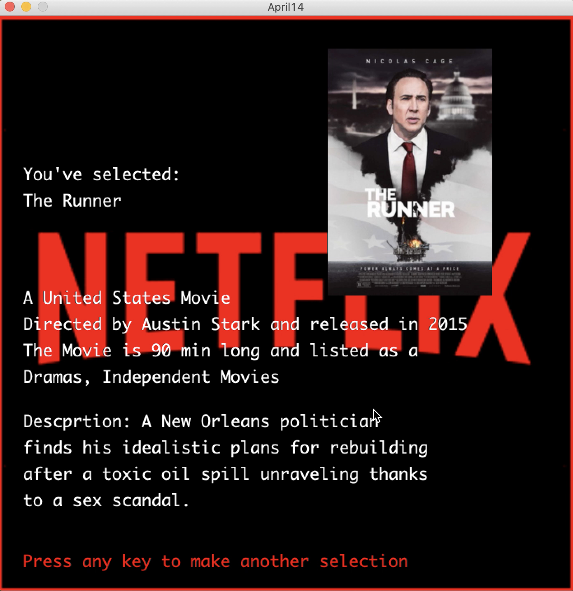

**Data Visualization/Generative Text:**

For this project I did a data visualization with some elements of a generative text. I downloaded netflix data from https://www.kaggle.com/shivamb/netflix-shows/data and saved it into a csv file. I cut the data down to 10 rows because I wanted to have the posters of all the movies/tv shows cycling through on the screen to show a random selection. The data was too long to get every poster so I settled for 10. This source: https://forum.processing.org/two/discussion/8085/i-display-images-in-sequence-but-i-see-only-the-last-one-why helped me figure out how to loop through the cycle of photos using milis() instead of delay. I uplaoded the images and used a for loop to cycle through the images and millis() to give each poster 0.1 seconds before transitioning into the next one. I used an if condition to instruct that when the user presses the enter button the cycled image would stop and display the information for that posters movie/tv show. The information included the director, how long it was, what country it was made in, as well as a short description. When the user presses any button after that it returns back to the random cycling of images. 

I have the netflix logo as the background as well. I thought this was a fun way to show the data as random movie or tv show selections that gets the information out while still being interactive and fun. 

A series of images is cycled:

Once the user presses 'enter' a selection is made and presented like this:
 

[Here](https://youtu.be/xzwcdD4sbqo) is a video of the program!

Problems I faced:

One of the problems I faced was making the images cycle through with 0.1 second difference between images. Originally, I was using delay() however this stopped the entire program and didn't allow me to display the text while the image was paushed. Therefore instead I opted to increment the DISPLAY_TIME variable to a number that was very long so as to seem as though the image stopped but instead it is just paused for a very long time. Another problem I faced was making sure that when the cycle of images stopped it stopped on the correct poster for the chosen information from the csv file. To resolve this I had to make a new column in the csv file and put 0-9 in the rows. This corresponded to the name of the jpg file for ex. movie0.jpg, movie1.jpg, etc. Thus when the the cycle stops it would stop at the index corresponding to both the csv file column and the name of the jpg and load the correct image on the screen. Finally, aligning all the text on the screen from the csv file (generated text) took a bit of time and trial and error but eventually everything fit. One thing I wanted to do was make the netflix background a bit transparent and originally I had used tint(), however, the color was changed to a gray rather than a black so I decided to keep the background as is.The tint I used in the program was to change the outline of the screen to red, as the image I downloaded from the web originally had a yellow outline around it. 

References:
- https://processing.org/reference/text_.html
- https://processing.org/reference/background_.html
- https://processing.org/reference/tint_.html
