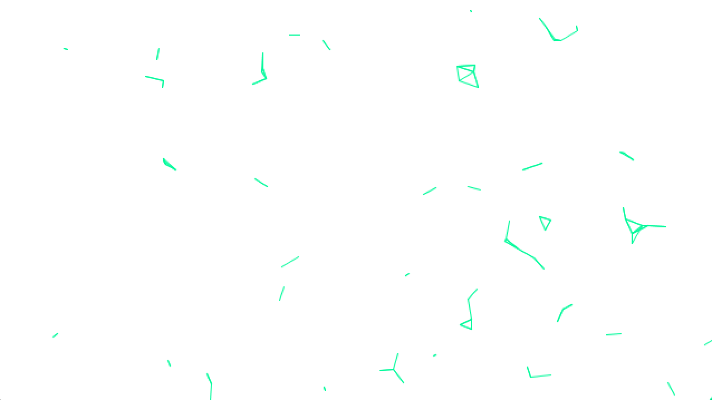
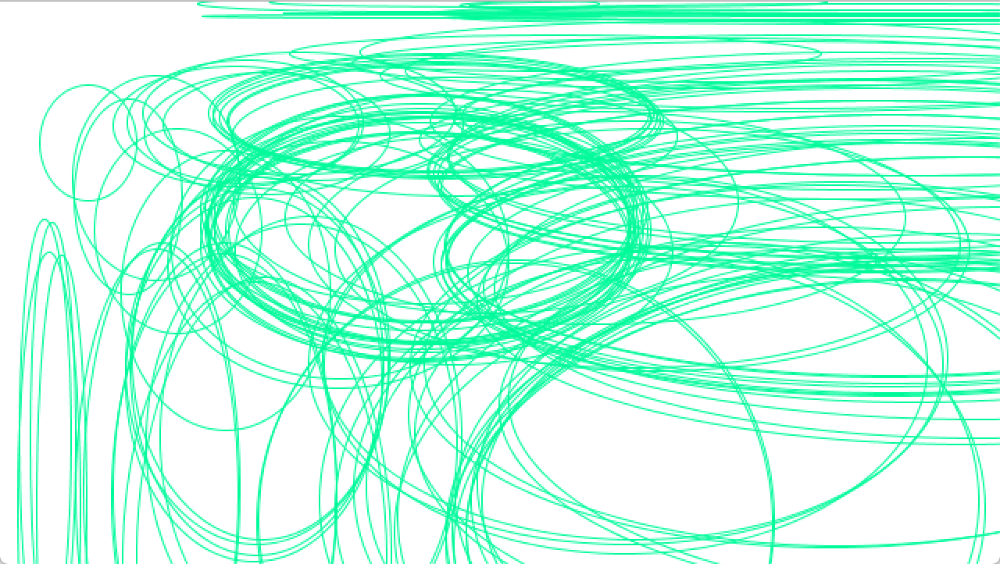
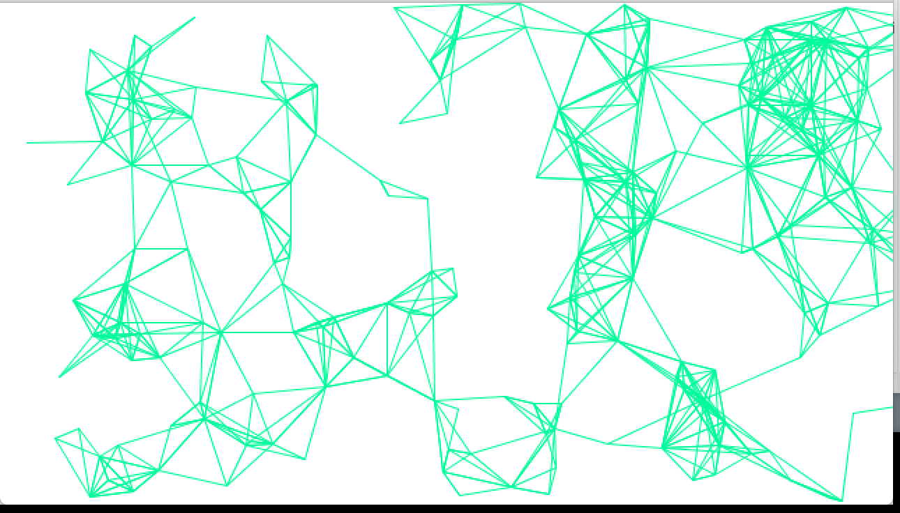
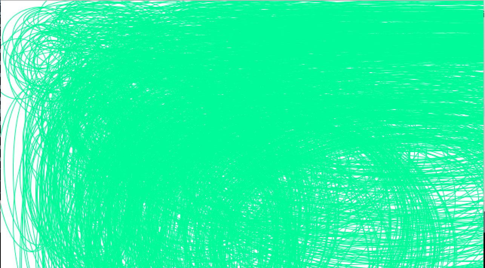

**Class Example Experimentation:**

Description:
For this assignment I experimented with an example made by Aaron Sherwood. The original and experimented version pictures are shown below. Some of the things I changed to better understand the code were:

- multiplying the velocity by a larger number in the rotateLine() function. This caused the lines to rotate extremely quickly and then disappear from the screen. I think this is because the lines were moving in different directions and too quickly to make new line connections and so they just disappeared after spinning for a while. 

[Here](https://youtu.be/tATXuSaq2GU) is a video of the lines!

- I also changed the shape from a line to ellipse. It created what can be seen in the video below. I kept the velocity * 2 and the circles rotated really fast as well and eventually disappeared. I had to reduce the radius to (10, 20) because the original (10, 80) created too many ellipses and it was hard to see the movements clearly. I'm still not entirely sure why the ellipses and line disappear when the velocity is multiplied by a larger number, but the result is very interesting to watch. 

[Here](https://youtu.be/sXKijkbjToo) is a video fo the circles!

- Finally I played around with radius number to see how it would affect the lines. I realized that the smaller the range the less lines would show up on the screen. This is probably due to the raidus obviously being smaller as well. I have attached photos of the experimentation below. I also did it with the ellipses and found the same result.

radius (10, 20):

radius (10, 80):

