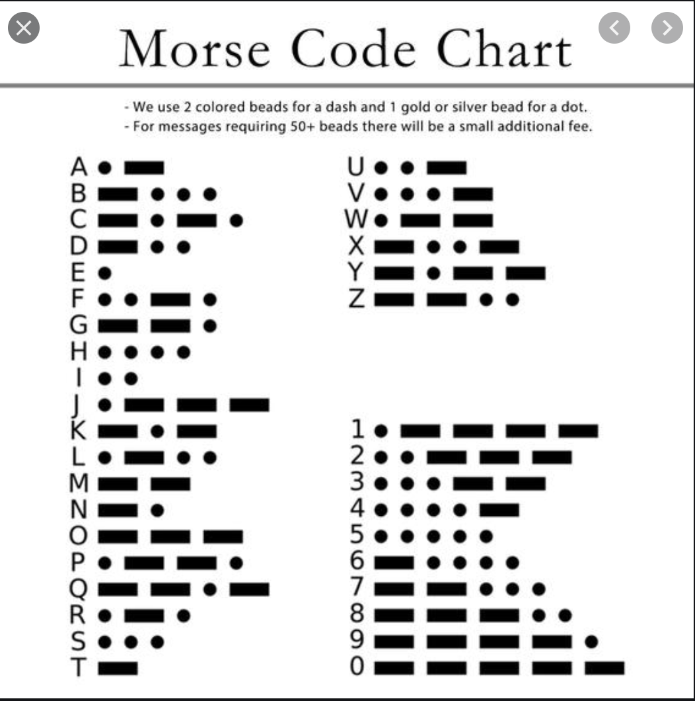
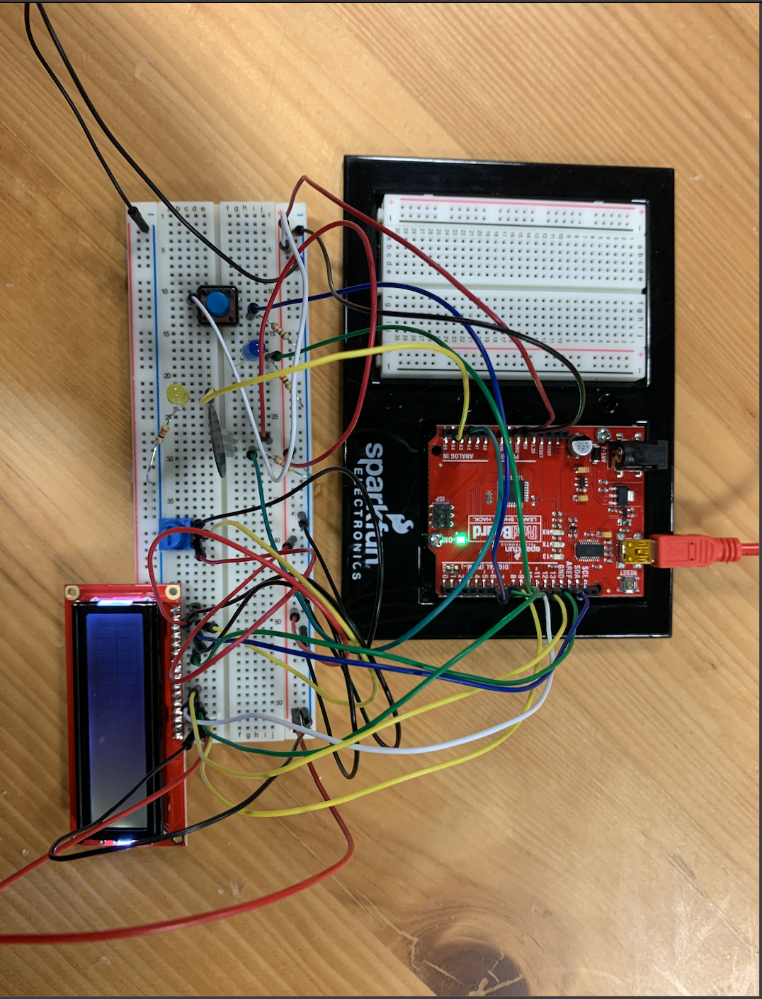
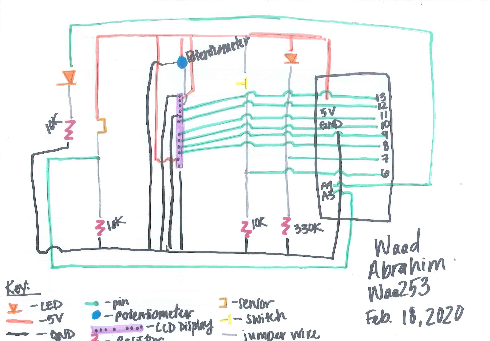

**Description:**

My project uses analog input and output and digital input and output. I used a pressure sensor and a switch for my analog input and digital input respectively. 

The idea for my project came from my interest in crime shows. I was always fascinated with morse code so I wanted to incorporate it in my project. I manually coded and LED light to flash in morse code to say "Hello World." When you click the switch this morse code LED flashing is activated. As each letter is coded it will appear on the LCD display. This gives off the illusion that as the light is blinking in morse code, it is being translated onto the screen. I wanted to make it more interactive so that a user can use the button to code their own words which would be dispalyed on the LCD screen. This proved to take longer than the time I had to complete this project, however I will be experimenting to see if this idea can actually be implented with the arduino. 

For the analog portion of my project I used a pressure sensor, when you press it it will record a number. I mapped those values to the LED in order to get it to be brighter or dimmer based on how much pressure is recorded. This was difficult and didn't work well. When I press the sensor the LED turns on but it does not seem to show a range in brightness, just no or off so it didn't work the best. I tred to also use the bending sensor but that did not seem to function properly either. I printed the values on the serial monitor and it seemed to be funcioning fine but the sensor may be too sensitive to see the range in the LED light. I also had an if condition that display OUCH on the LED display if the sensor was activated.

[Here](https://www.youtube.com/watch?v=GLF64icoNmM) is the video to see it working!

**Here is the Morse Code translation I used:**

**Here is the picture of my circuit:**

**Here is the schematic for my circuit:**

