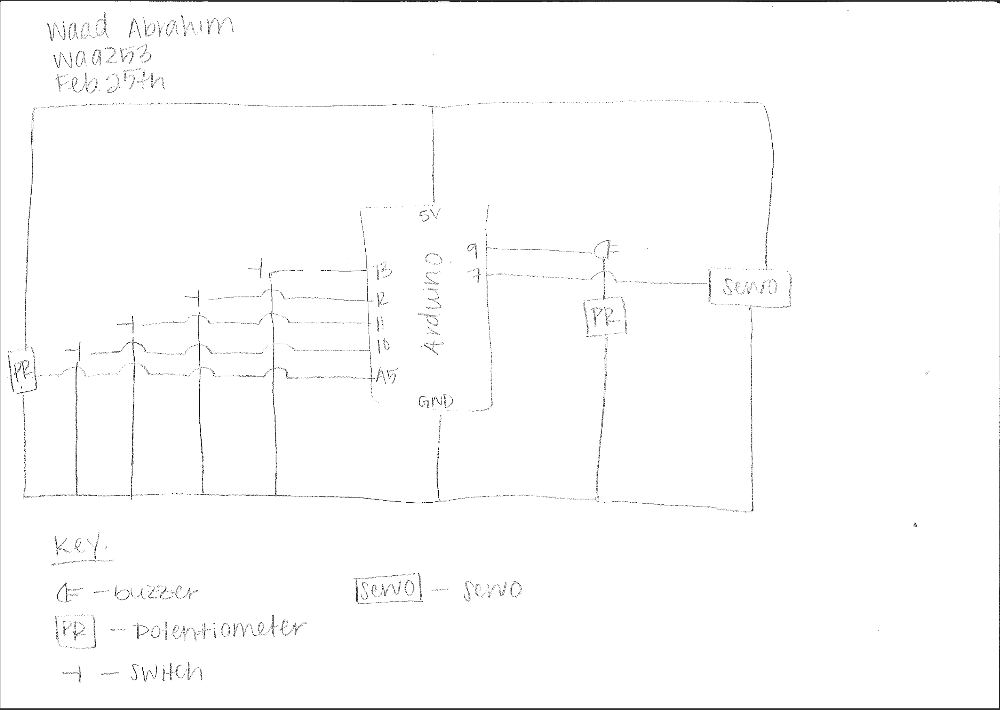

Description:

For this project I wanted to create a musical instrument that has a background beat and a front melody. I accomplished this task by using the servo motor and attaching a stick to it so it can hit the lid of a container and make a drum noise. I added a patentiometer to control the speed of at which stick (servo) hit the lid. This created different beats for the background. I then used a buzzer and switches to create a piano like instrumen. The piano had the following notes: c, d, e, g, b. These notes were the front melody. In combination with the drum beat the two function as a full musical instrument where the user can control the beat and the melody all in one circuit. 

This idea was developed after thinking of trying to create some form of dj system. These systems allow for multiple layers of music to be played simultaneously. I implemented this idea to a smaller degree by haveing two layers, a background beat and front end melody. However, a problem I faced was how to play the drum because currently the user has to hold the servo and play it on the lid. To improve the project, given more time, I would have wanted to build a stand (possibly from wood) to allow the servo to be played hands free. This would give the user more free mobility to play the instrument. Otherwise, I think the project was executed sufficiently. 

[Here](https://www.youtube.com/watch?v=NDApYxl4AfY) is a video of the musical instrument. 

Here is a picture of the full operation:

Here is a picture of the circuit:

Here is the circuit schematic:

