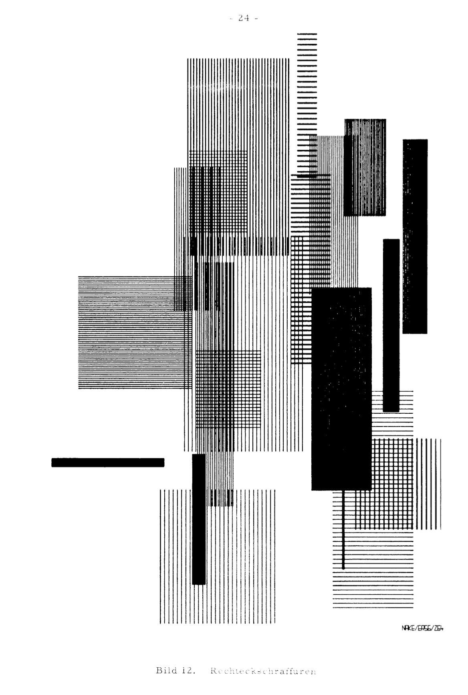
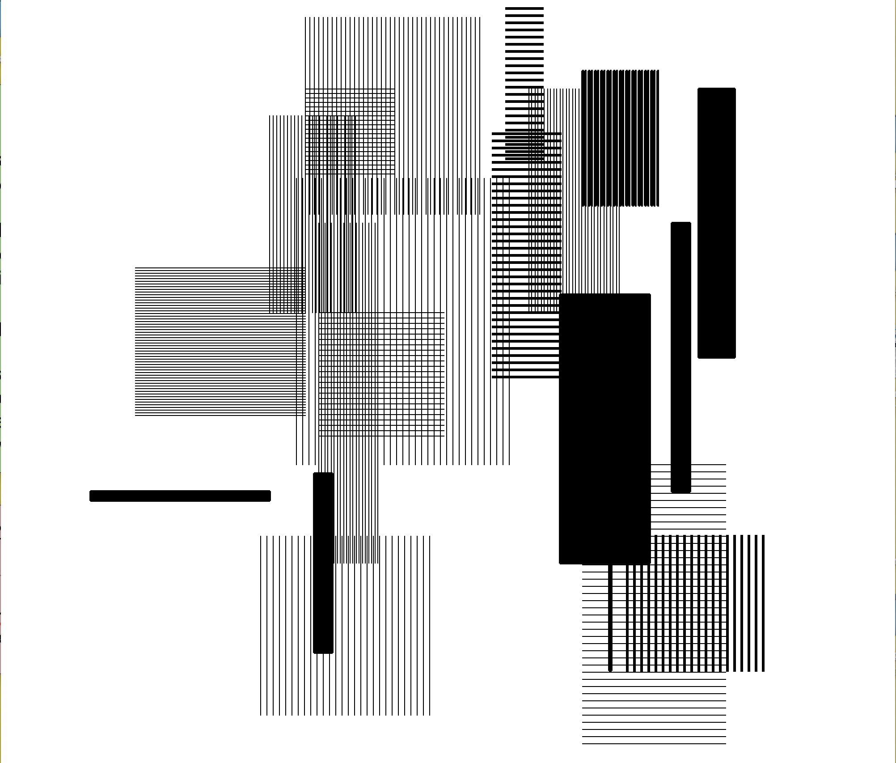

**Computer Graphic**

For this project I duplicated an old computer graphic using simple shapes: lines and rectangles. While completing the assignment I used functions, translate(), rotate(), and some more basic processing features (setUp and draw). Using translate was useful because I was able to figure out the positions of the different shapes based on their relativeness to one's already on the screen. It made the process of aligning everything correctly on the canvas a lot easier. The functions I made helped me create vertical and horizontal line groups effortlessly by simply giving the functions certain arguments to customize the size and look. 

The most difficult part was keeping track of the shapes I was making in my code. I decided to resolve this by starting with one shape and then identifying the others relative to that shape and going from there. For ex. the first shape was at the bottom, the next was translated from that shape to the right and up, the next one translated from there and so on. Overall, the process was somewhat time consuming but I made good efforts efficiently complete the assignment. 

The original photo was taken from this site: http://dada.compart-bremen.de/docUploads/ProgrammInformation21_PI21.pdf

**Original Photo:**

**Recreated Drawing:**

