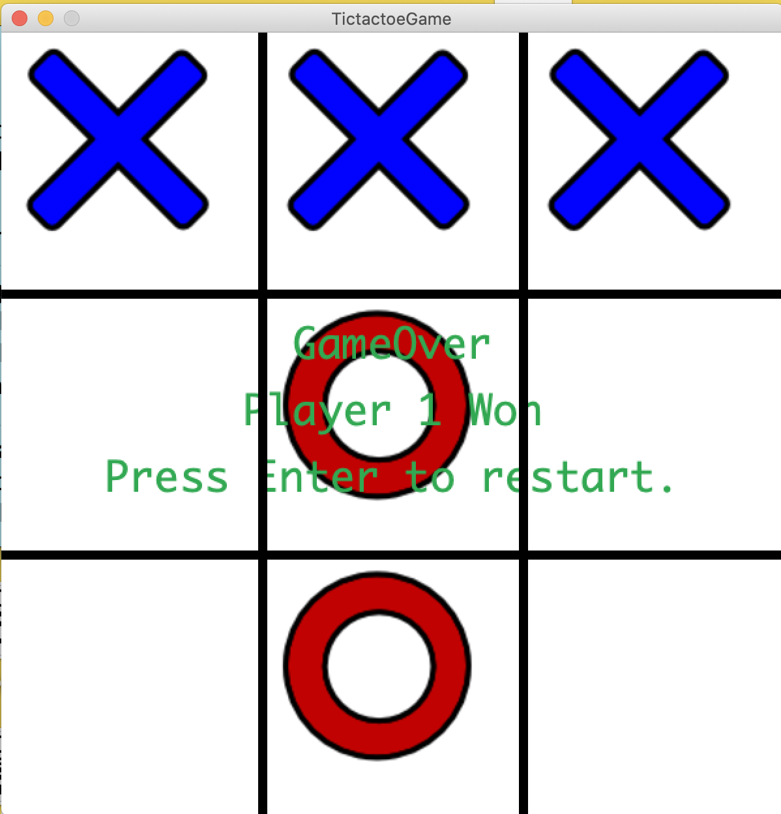

**Object Oriented Programming:**

Overall Concept:

For this project I created a basic tic-tac-toe game. I downloaded images from the web for the 'x' and 'o' and used them in my program. The object oriented programming helped with keeping all the functions and properties of the game in one class. I had a hidden board and a display board. The hidden board helped with keeping track of who wins and when the game is a draw while the display board is a visual for the players. 

This project helped me understand how to uses classes and make objects, as well as print font on the screen as well. creating the object was confusing at first because I originally had it placed in the draw function but soon realized it needs to be initialized as a global nulln variable and then re-defined in the setup() to properly run. The font was fun to play with, changing the colors and position. 

[Here](https://www.youtube.com/watch?v=LZd8QkYebRM)  is a video of the game being played!

Image of the game:

Problems:

I had a few issues with my code. Firstly, I had trouble changing the player so that the image would alternate between 'x' and 'o' (the 2 players). I resolved this by creating an array that held both players as strings and used remainder division to to alternate between 0 and 1, the places of the players in the array. The equation I used was (playerPosition+1)%2. Another problem I faced was creating a function to figure out when a player wins. I couldn't find a way to check if an image 'x' or 'o' was in a particular position so instead I created a hiddenBoard that mirrored the board displayed to the player. This board would be printed in the system and using the index feature (hiddenBoard[x][y] for ex.) I was able to use nested for loops to check if either player had won the game (got 3 in a row either horizontally, vertically, or diagonally). Finally, one of the last problems I faced was getting the game to restart at the end. Orignally I put setup() in the class so that when the winner was found it would automatically restart. However, this resulted in the last image (winning move) not being displayed on the screen and the game restarting without allowing any printing of the winner to be seene either. I tried to use the delay() function so the restart to setup() wouldn't happen so fast but that only resulted in the game pausing and again restarting before the final move can be seen on the screen. Ultimately, to resolve this issue I defined a keyPressed() outside of the class so that when the player clicks ENTER it will start a new game. The only issue is if the player clicks ENTER at any point throughout the game the game will still restart. 
