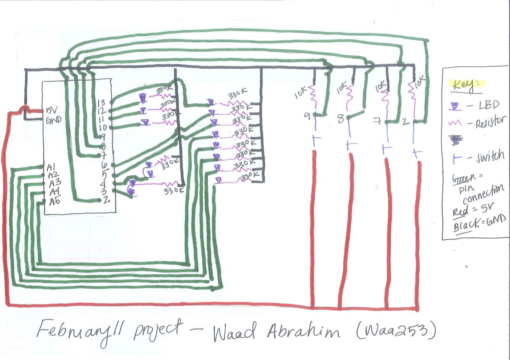

**Project explanation:**

For this project I was inspired by traffic and police lights. I set 3 buttons: green, yellow and red and 3 LEDs of the same colors. I also had 2 pairs of blue LEDs that would act as "cars" in response to the button pressed. When you press the red button, the red LED turns on and the "car" (blue) LEDs remain off. When you press the yellow button, the yellow LED turns on and the "cars" blink but with a slower delay. When you press the green button, the green LED turns on and the "cars" blink rapidly with a faster delay time. This is supposed to mimic an actual traffic light. 

To create my police light I placed 8 LEDs in a row: 3 red, 2 white, and 3 blue. I coded the program so that different combinations of the LEDs could be turned on in order to look like the siren light of a police car. I had a blue button that controlled when these lights turned on. The outcome was relatively accurate to the real police emergency light.

**Program:**

int pushButton = 9;
int pushButton2 = 8;
int pushButton3 = 7;
int pushButton4 = 2;
int count = 0; //keeps count of how many times a loop happens
// the setup function runs once when you press reset or power the board
void setup() {
  // initialize digital pin LED_BUILTIN as an output.
  //initialize digital pinButton as an input.
  pinMode(pushButton, INPUT);
  pinMode(pushButton2, INPUT);
  pinMode(pushButton3, INPUT);
  pinMode(pushButton4, INPUT);
  pinMode(3, OUTPUT);
  pinMode(4, OUTPUT);
  pinMode(10, OUTPUT);
  pinMode(11, OUTPUT);
  pinMode(12, OUTPUT);
  pinMode(13, OUTPUT);
  pinMode(A5, OUTPUT);
  pinMode(A4, OUTPUT);
  pinMode(A3, OUTPUT);
  pinMode(A2, OUTPUT);
  pinMode(A1, OUTPUT);
  pinMode(5, OUTPUT);
  pinMode(6, OUTPUT);
}

// the loop function runs over and over again forever
void loop() {

  int buttonState = digitalRead(pushButton); //reads if the button is being pressed or not
  int buttonState2 = digitalRead(pushButton2);
  int buttonState3 = digitalRead(pushButton3);
  int buttonState4 = digitalRead(pushButton4);

  if (buttonState == 1) { //Green button is pressed and leds will blink quickly 
    digitalWrite(10, HIGH);
    digitalWrite(3, HIGH);
    digitalWrite(4, HIGH);
    delay(100); // wait a second
    digitalWrite(3, LOW);
    digitalWrite(4, LOW);
    delay(100);
    digitalWrite(3, HIGH);
    digitalWrite(4, HIGH);
    delay(100);
    digitalWrite(3, LOW);
    digitalWrite(4, LOW);
  }
  else { //no light on when button is not pressed
    digitalWrite(10, LOW);
    digitalWrite(3, LOW);
    digitalWrite(4, LOW);
  }

  if (buttonState2 == 1) { //yellow button pressed then leds will blink slower
    digitalWrite(11, HIGH);
    digitalWrite(3, HIGH);
    digitalWrite(4, HIGH);
    delay(1000); //wait a longer second 
    digitalWrite(3, LOW);
    digitalWrite(4, LOW);
    delay(1000);
    digitalWrite(3, HIGH);
    digitalWrite(4, HIGH);
    delay(1000);
    digitalWrite(3, LOW);
    digitalWrite(4, LOW);
  }
  else { //no light on when button is not pressed
    digitalWrite(11, LOW);
    digitalWrite(3, LOW);
    digitalWrite(4, LOW);
  }

  if (buttonState3 == 1) { //red button pressed then leds will not turn on
    digitalWrite(12, HIGH);
    digitalWrite(3, LOW);
    digitalWrite(4, LOW);
  }
  else {//no light on when button is not pressed
    digitalWrite(12, LOW);
    digitalWrite(3, LOW);
    digitalWrite(4, LOW);
  }

  if (buttonState4 == 1) { //blue button pressed is police light
    while (count != 4) { //loop 3 times blinking different variation
      digitalWrite(13, HIGH);
      digitalWrite(6, HIGH);
      digitalWrite(5, HIGH);
      digitalWrite(A5, HIGH);
      delay(100);
      digitalWrite(13, LOW);
      digitalWrite(6, LOW);
      digitalWrite(5, LOW);
      digitalWrite(A5, LOW);
      count += 1;
    }
    while (count >= 4 and count < 7) { //loop twice blinking different variation
      digitalWrite(A4, HIGH);
      digitalWrite(A3, HIGH);
      digitalWrite(A2, HIGH);
      digitalWrite(A1, HIGH);
      delay(100);
      digitalWrite(A4, LOW);
      digitalWrite(A3, LOW);
      digitalWrite(A2, LOW);
      digitalWrite(A1, LOW);
      count += 1;
    }
    while (count >= 7 and count < 10) { //loop twice blinking different variation
      digitalWrite(A4, HIGH);
      digitalWrite(A5, HIGH);
      delay(100);
      digitalWrite(5, HIGH);
      digitalWrite(6, HIGH);
      delay(100);
      digitalWrite(5, LOW);
      digitalWrite(6, LOW);
      count += 1;
    }
    while (count >= 10 and count < 13) { //loop twice blinking different variation
      digitalWrite(A4, HIGH);
      digitalWrite(A5, HIGH);
      delay(100);
      digitalWrite(A3, HIGH);
      digitalWrite(A2, HIGH);
      delay(100);
      digitalWrite(A3, LOW);
      digitalWrite(A2, LOW);
      count += 1;
    }
    while (count >= 13 and count < 16) { //loop twice blinking different variation
      digitalWrite(A4, HIGH);
      digitalWrite(A5, HIGH);
      delay(100);
      digitalWrite(13, HIGH);
      delay(100);
      digitalWrite(13, LOW);
      digitalWrite(A1, HIGH);
      delay(100);
      digitalWrite(A1, LOW);
      count += 1;
    }
    digitalWrite(A4, HIGH); //from the center blink each light turning it on in sequence
    digitalWrite(A5, HIGH);
    delay(100);
    digitalWrite(5, HIGH);
    digitalWrite(A3, HIGH);
    delay(100);
    digitalWrite(6, HIGH);
    digitalWrite(A2, HIGH);
    delay(100);
    digitalWrite(13, HIGH);
    digitalWrite(A1, HIGH);
    delay(100);
    digitalWrite(13, LOW); //from the ends blink each light turning it off in sequence
    digitalWrite(A1, LOW);
    delay(100);
    digitalWrite(6, LOW);
    digitalWrite(A2, LOW);
    delay(100);
    digitalWrite(5, LOW);
    digitalWrite(A3, LOW);
    delay(100);
    digitalWrite(A4, LOW);
    digitalWrite(A5, LOW); //all lights should be off
    count = 0; //resent count so when button is pressed again it will work with prior if condition set
  }

}

and [here](https://youtu.be/8oyehtyQiCw) is the video of the program functioning. 

**Here is a picture of the circuit schematic:**

