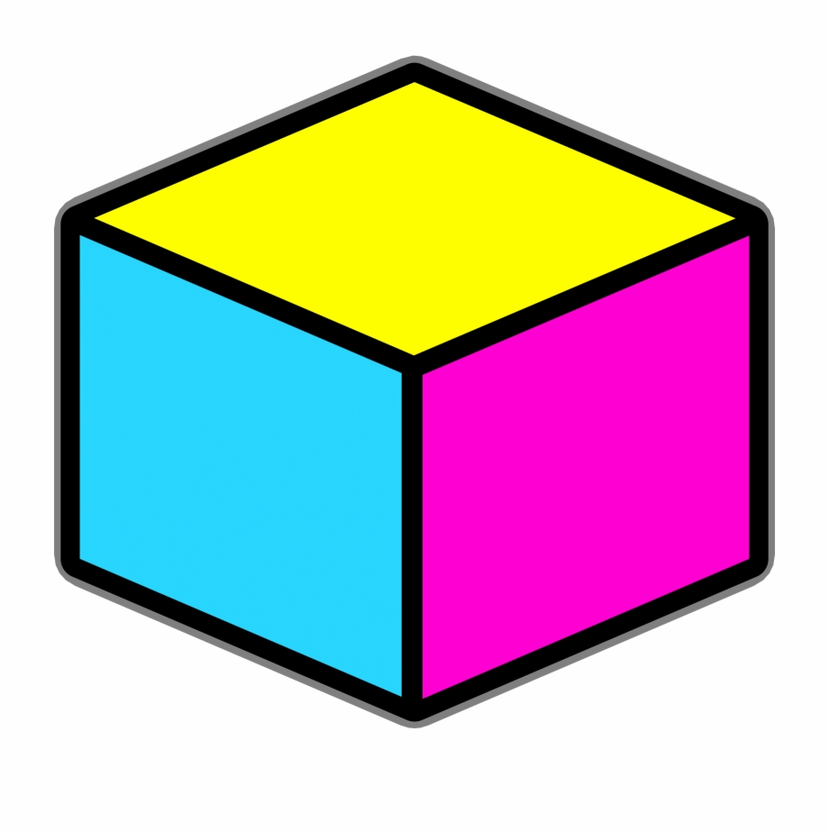
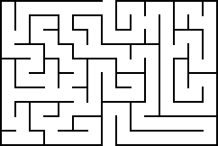
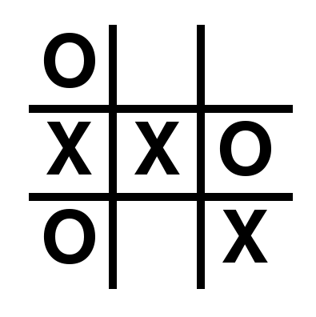
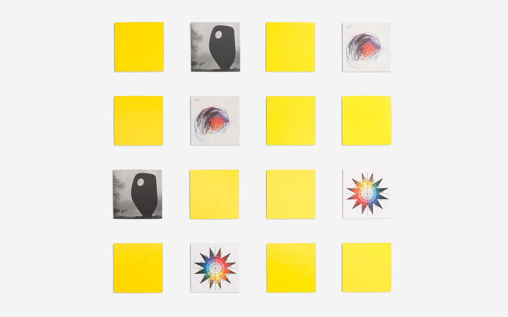

**Final Project:**

For our final we were asked to do anything with processing. I thus decided to build on my idea from the midterm and create a virtual game cube. This would be a cube that shows up when you run the program, and you roll the cube like a dice to play a game (alternativley one has the option to direcgtly choose a game to play). Some of the games would include, tic-tac-toe, finding your our out of a maze, matching game, memory game, and so on. I have not decided how many games I want included because some I have already created through our homework projects while others still need to be coded. My inspiration came from loving games and trying to find a way to have multiple games accessible through one device such as a game cube. This was unfortunatly not possible for my midterm due to time constraints but I hope to accomplish this for my final.

**Main Page/cube:**

**Maze:**

**Tic-Tac-Toe:**

**Matching:**

**Next Steps:**
- Need to finalize which games I will be incorpating in my program

- Start adding in the games that are already coded

- Start coding new games to be added to the cube
