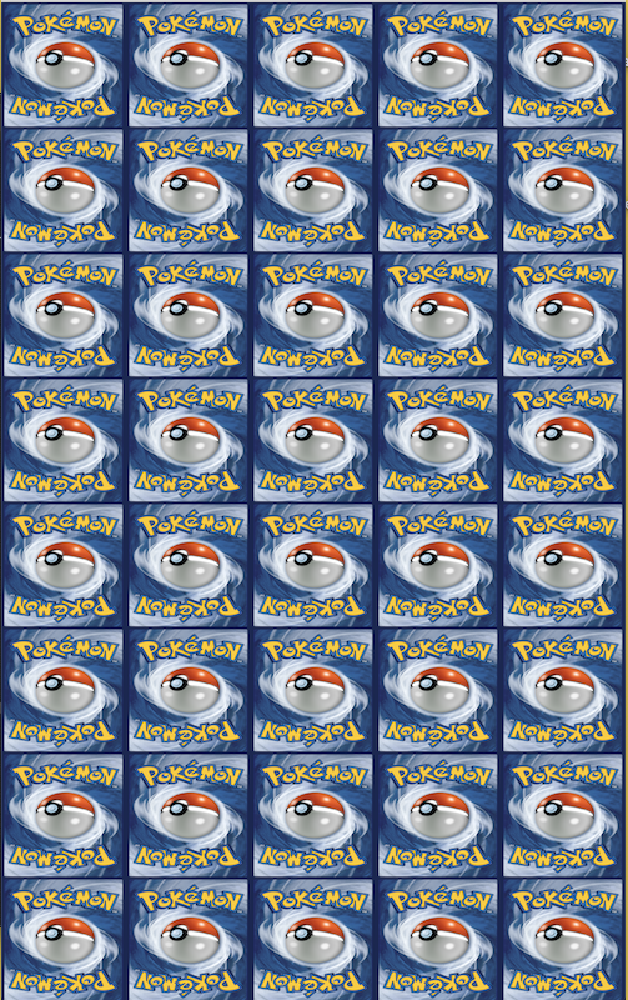
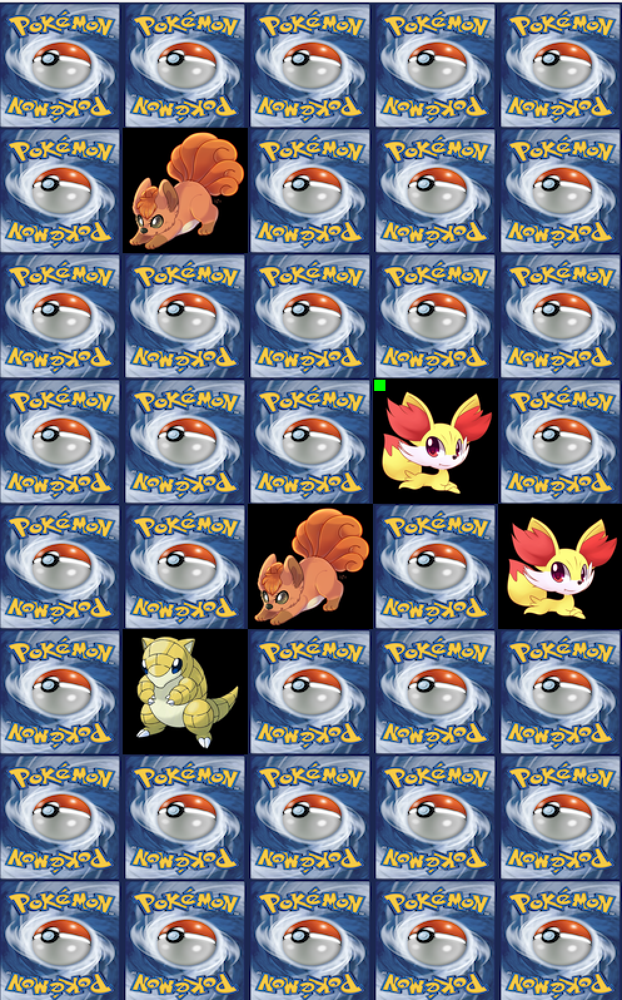

**Description:**

For our final project we were given the opportunity to do anything with processing. I really enjoyed making a game for one of our earlier projects so I decided to make another one for the final. My original idea is that I would use the previous games I have coded and the new game, a matching game, and put them all together. Essentially, a cube would be presented as the landing page and then it would roll like a dice and when the user clicked the screen it would pause and begin a specific game or activity. I had narrowed it down to 3 games/activites. One was the tic-tac-toe game, another was the netflix recomendation program, and the final one was the matching game I coded for this website. Unfortunately, due to time constraints and coding complications which I will explain in the coding difficulties section later I was unable to get all the different games/programs running together. I opted to instead just do the matching game which I had originally assumed would be an easy code to program, ended up taking me a whole week to figure out and perfect.

[Here](https://youtu.be/Sz0JIMopTuY) is a video of the matching game program running!

Here is an image of the start of the game:

Here is an image of matching game in progress:

**Coding Complications:**

When coding my matching game I struggled with a few things. After loading all the cards onto the screen and making sure that the cover card was first presented unless the clicked, I ran into issues with getting two cards to be displayed and checked before changing to the next player. The check method that checked to see if the first card clicked and the second card clicked were the same, and increase the score for that player, was happening so fast that the second card couldnt display before both cards were turned back to the main cover card and the next player could play. To resolve this issue, I created a temporary holding array that held 3 card and would add a card to the array after each click. Once the 3rd card is reached the check method starts and only checks the first two cards. If those cards are the same it keeps them showing, otherwise it turns back to the cover card. Then, the 3rd card is assigned to be the first card in the array and the next clicked card is assigned to be the secon card in the array, and the process repeats. 

Another issue I faced was shuffling the cards to make sure the order was randomized every time the game was played. In order to resolve this issue I opted to use a list instead of an array. I loaded all the values of the cards, 20 cards, and used the shuffle() funtion of lists to randomize the order before it is displayed on the screen.

Finally, one of the last issues I faced was keeping track of who was winning or a visual way for the players to keep track of whose matches belonged to which player. To resolve this issue I created a small rectangle in the corner of the card when a match is made that by color will indicate who was made that match and earned that point. A green rectangle indicated player one, and a black one indicated player 2. This helps the players visualize who is leading and winning. At the end of the game, text is displayed with the winner of the game and instructions (click 'ENTER') to restart the game and play again. 

**Sources:**

- https://processing.org/reference/IntList.html

- https://processing.org/discourse/beta/num_1207692372.html
