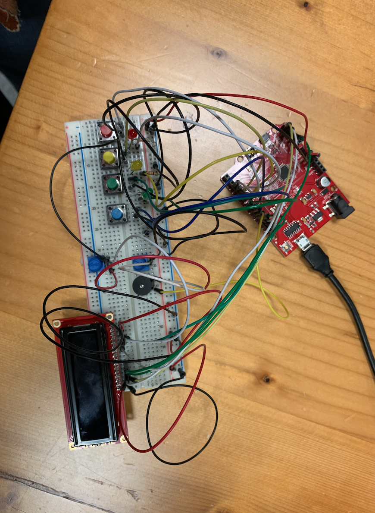
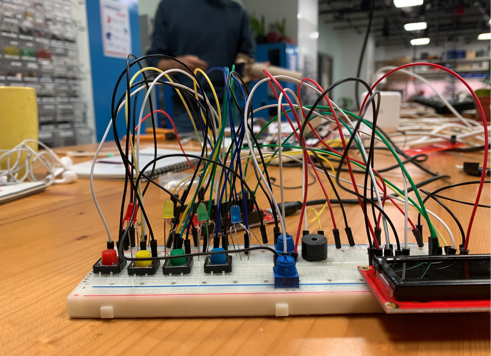
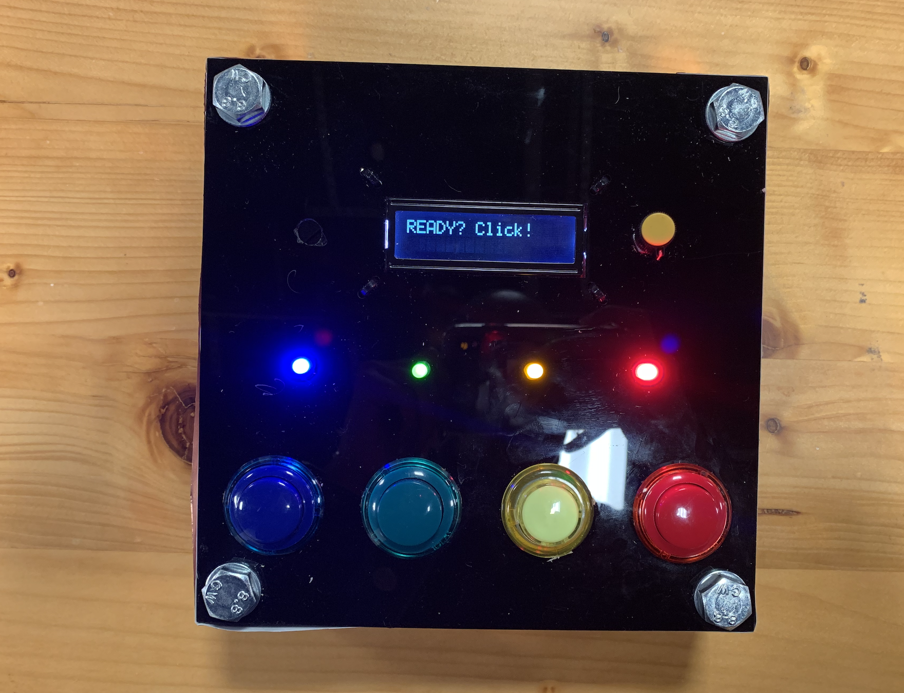
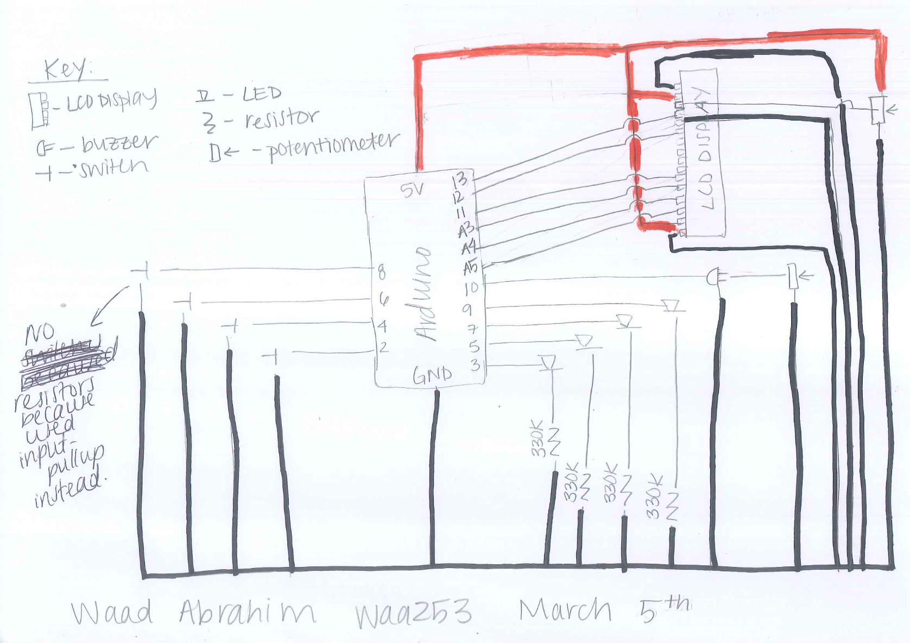

**Documentation:**

**I had a lot of pictures. I uploaded them to the laptop and deleted them from my phone and my laptop crashed. So this needs some imagination but I tried to be as detailed as possible**

[Here](https://youtu.be/AJ9vP0mamHc) is a video of the memory game I made.

**Brainstorming:** When thinking of an idea for this project I wanted to make it fun and something I would want to use. This is why I thought of creating a game. My initial idea was to create a game cube where each side of the cube would have a game on it. I came up with 3 games. The first game was a memory game (“Simon Says”), the LED lights blink in a specific order and the user can use colored switches to match that order. If they are correct they can move to the next round if not, the LCD display reads “Game Over!” and the user must try again. The second game was a reactionary/reflex game. When an LED light blinks the user must click the switch that corresponds in color. This would be a game that tests how fast the user can click the switch. The final game was going to be riddle based. A riddle would flash on the LCD. The answer to the riddle, for example “light”, would prompt the user to perform an action such as covering a photoresistor light sensor. The final game I figured would be the hardest to make and I was considering removing it if I didn’t have time. However, it later became clear that my expectations were way to high and I did not anticipate the problems I ended up facing/having to accomodate for. 

**Prototyping:** As I began developing the game, I created a prototype first. I used my notes from class to wire up LEDs and switches. The lights worked, I was even able to get them to blink in a random order each time the loop ran. However, as I was coding I ran into an issue of getting the program to remember the pattern in which the LED blinked. Without remembering that pattern I had no way of checking if the user was inputting the same pattern. I tried several different methods, and checked online, I ended up finding the solution in the book and used that code to run my program. I realized through this experience that 1. Coding from scratch is a lot more difficult and you have to break down the steps for the program, 2. I was not going to be able to create 3 games so I needed to simplify my idea, and 3. This was a lot harder than I expected. I also used INPUT-PULLUP in the code to use the internal resistors from the arduino because my circuit was already becoming too complicated and this method still allowed the program to run efficiently.  

Here is the full circuit:

Here is a close-up of the circuit:

**Developing:** After the prototype was ready I began collecting materials to design what my game will look like. I knew I wanted it to be in a box as I was still trying to slightly commit to my game cube idea. I tried to use wood at first but it was difficult to get it cut perfectly so instead I decided to use acrylic instead. To save plastic I only made a top and a bottom and screwed them together in the four corners (left some space in the middle to put in my circuit).
I then began soldering. At first it was hard to use the machine but I practiced on some spare wires and managed to make a few circles (one wire connecting both ends). After some practice, I soldered the switches, LEDs, and potentiometer (checked that they worked by connecting them to my breadboard manually). I also wanted a louder speaker so I soldered one and connected it to the board as well. I then added them to my circuit, replacing my protype pieces. I also had to solder wires together to create a male to female wire for my LCD display (they ran out at the IM Lab). Whenever I soldered I also used the insulation tube (clear plastic tubes), heated with the dryer, to cover the part of the wires that was soldered. Once these were made I had all the different parts to put my box together.
I then started assembling the box. I hot glued the LED’s to the box, screwed the switches in the holes, and screwed the potentiometer as well. The LCD display fit in the box as well and I used zipties to make it stay in place (used black  to match the acrylic and make it look nice). My box/hardware for my project was complete at this point. 
Testing/Aesthetics:  Once everything was put together I hot glued my buzzer, solderless breadboard, and arduino to the bottom of acrylic. I then slid in the solderless breadboard, arduino, and made sure all the wires were connected as indicated on my schematic. I ran the code to make sure it was still working. Once that was confirmed I used pink paper to cover the sides of the box (hide the wires). I used a battery to power the game instead of connecting the arduino to my laptop. This way the game could be portable and again is a little more authentic to the game cube idea I originally wanted to do. I tested the game several times and it worked. 

**Reflection:** I really enjoyed making this project. The game is actually something I want to play so I’m happy that I was able to create something fun that I and others can enjoy playing. I learned a lot about the process of moving from an abstract idea to an actual product. I had a large idea, had to simplify it, struggled with the code (which I originally thought only require a few if statements and loops), and practiced a lot with building. The experience was rewarding though and I am happy with the final product. Pictures (what’s left of them) can be found below.

Here is the game front view:

Here is the game side view:

Here is the inside of the circuit:

Here is the schematic:

